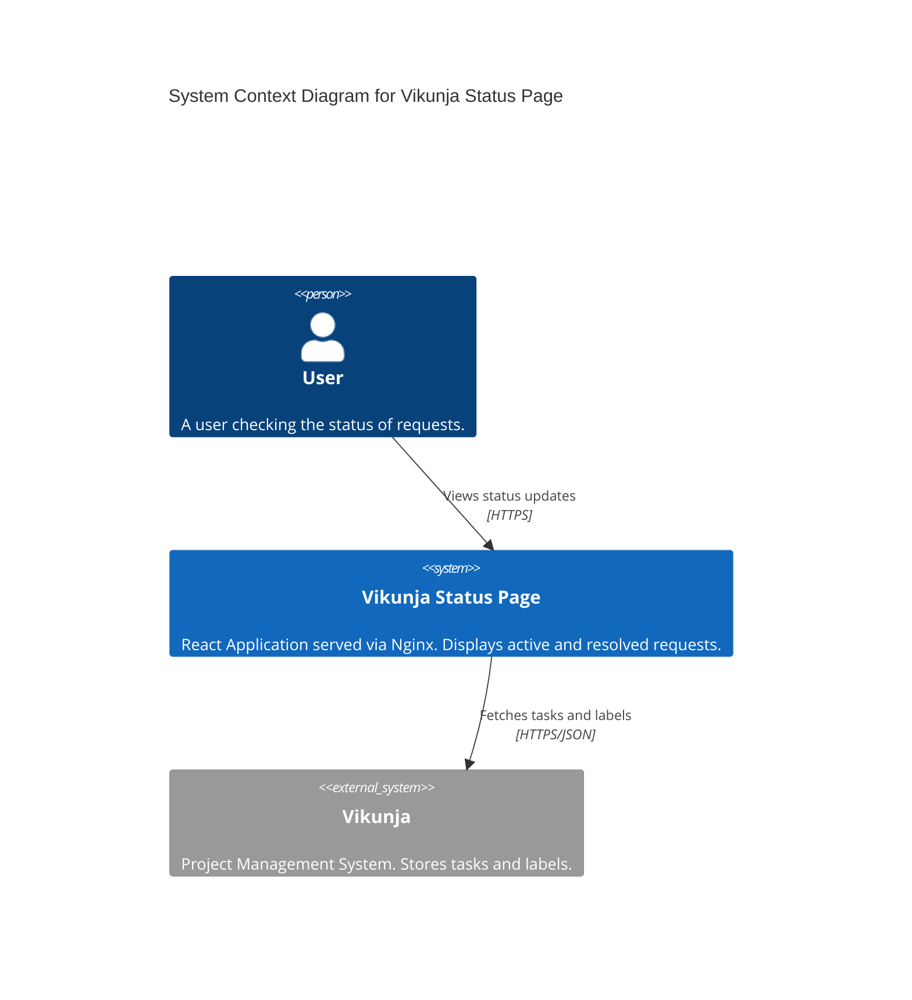
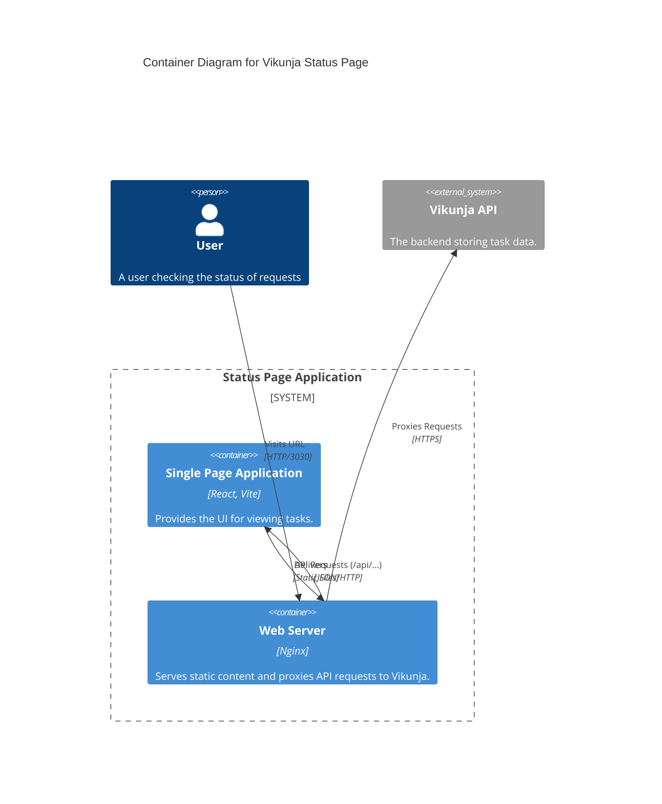
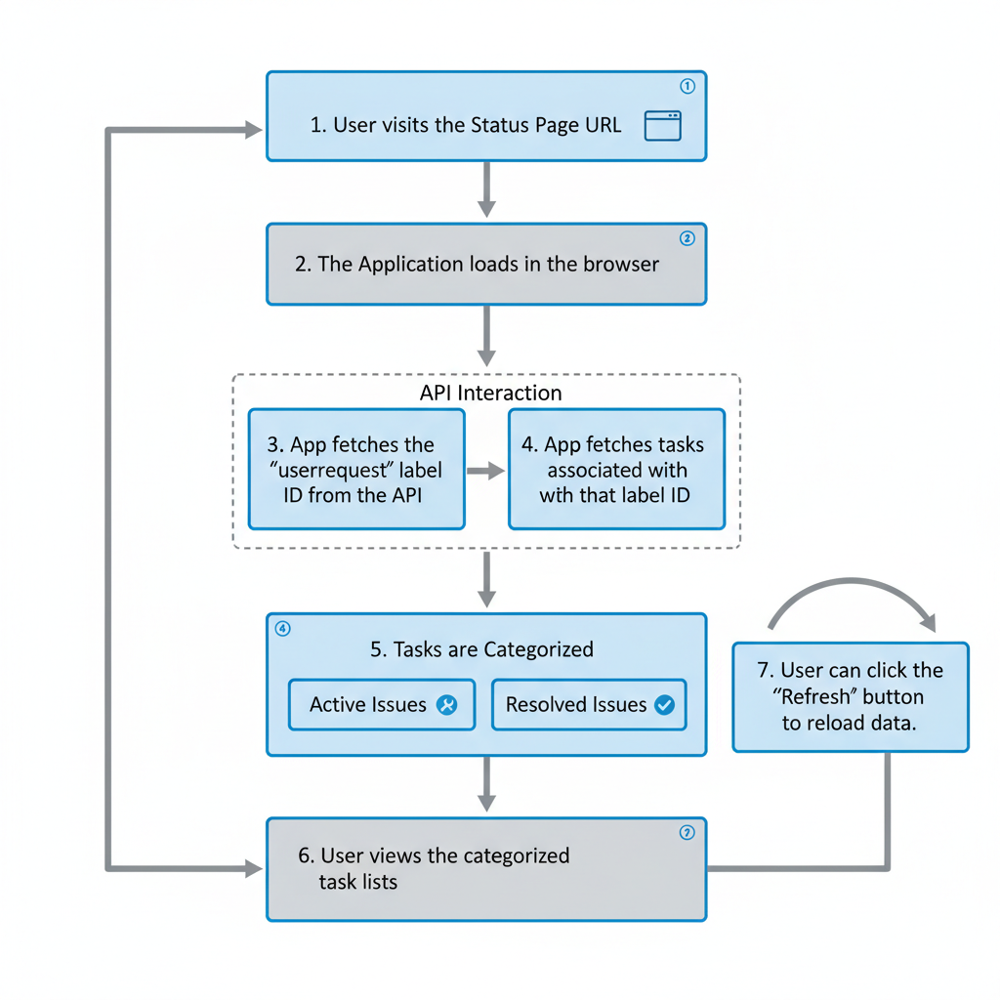

# System Architecture

## Overview
This application is a Status Page frontend that displays specific tasks from a Vikunja instance. It allows users to view the status of "user requests" without needing direct access to the Vikunja project.

## System Context Diagram (C4 Model)

## Container Diagram

## Data Flow
1.  **Initialization**: The React application loads in the user's browser.
2.  **Configuration**: The app checks for environment variables (`VITE_VIKUNJA_API_URL`, `VITE_VIKUNJA_API_TOKEN`, `VITE_USER_REQUEST_LABEL`) to configure the API connection.
3.  **Label Lookup**: The app requests all labels from Vikunja to find the ID of the configured label (default: `userrequest`).
4.  **Task Fetching**: The app requests all tasks filtered by the found Label ID.
5.  **Rendering**: Tasks are sorted into "Active" and "Resolved" lists based on their completion status and rendered to the user.

## User Flow Diagram
