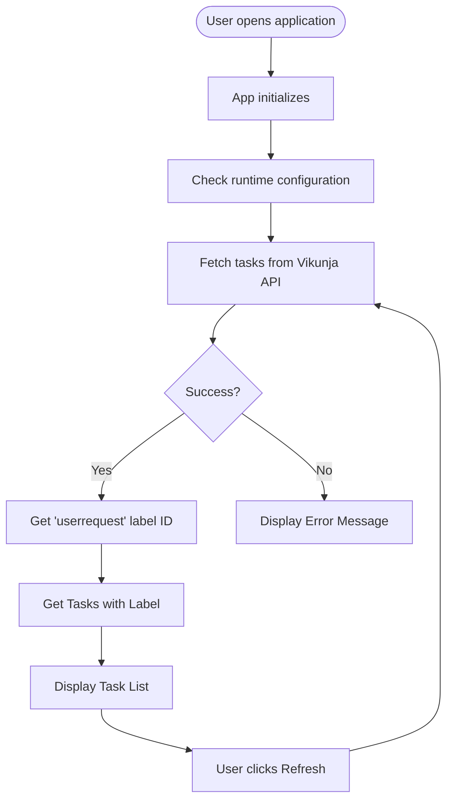

# User Flow

```mermaid
flowchart TD
    Start([User opens application]) --> Init[App initializes]
    Init --> Config[Check runtime configuration]
    Config --> Fetch[Fetch tasks from Vikunja API]
    Fetch --> Check{Success?}
    Check -- Yes --> Filter[Get 'userrequest' label ID]
    Filter --> GetTasks[Get Tasks with Label]
    GetTasks --> Display[Display Task List]
    Check -- No --> Error[Display Error Message]
    Display --> UserRefresh[User clicks Refresh]
    UserRefresh --> Fetch
```
